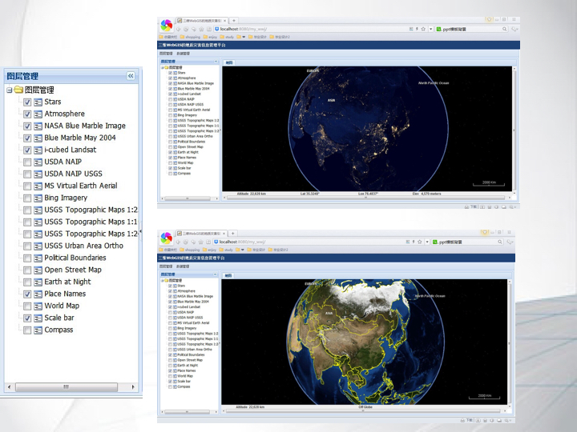
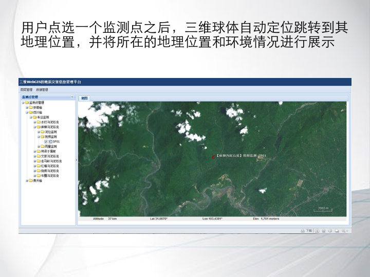
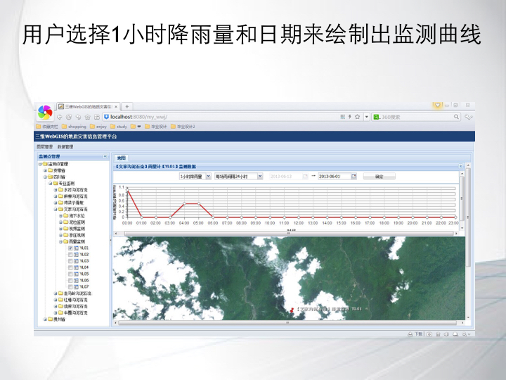

# senior-design-project
Geographical Disaster Information Management Platform Based on WebGIS

Based on SOA, ExtJS GUI (design fundamental framework of geological disaster management platform) and JQuery Ajax(interactive communications with WebService and Servlet), complete a preliminary study and discussion on building this platform, and complete system of geological disaster information management platform can control layers, show location monitored and show a Line chart depicting the data, which provide a viable solution for technology development research.

The main html file is index.html which shows:(The picture is Chinese because it's my Chinese senior design project)

The Layer panel can click checkbox to enable or disable certain layer(Layer information is from Webservice):

The Position panle can click checkbox to find a certain location (Position click searches the certain database which stores location information)

Draw a line chart depicting the Geographical Disaster data of certain location.

