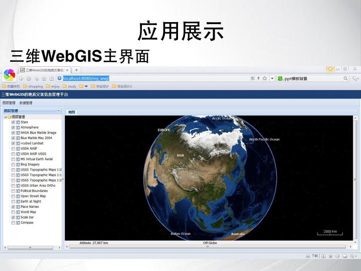

# senior-design-project
Geographical Disaster Information Management Platform Based on WebGIS

Based on SOA, ExtJS GUI (design fundamental framework of geological disaster management platform) and JQuery Ajax(interactive communications with WebService and Servlet), complete a preliminary study and discussion on building this platform, and complete system of geological disaster information management platform can control layers, show location monitored and show a Line chart depicting the data, which provide a viable solution for technology development research.

The main html file is index.html which shows:

